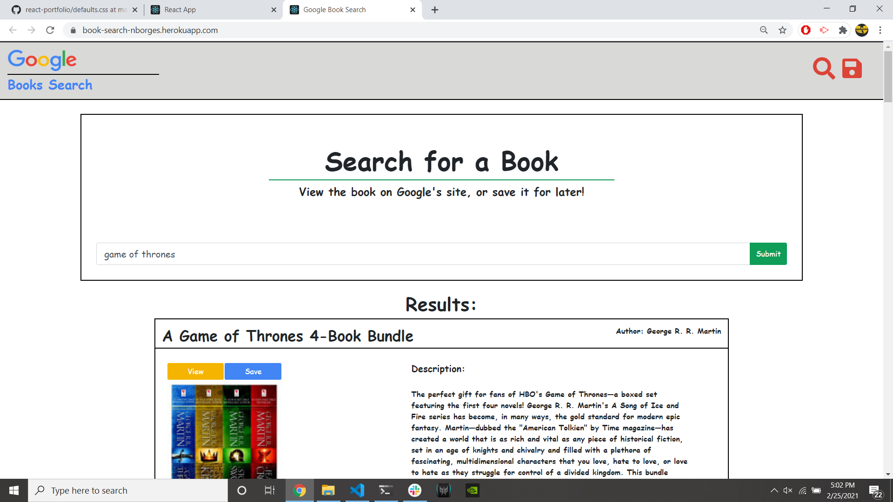

 # Book Search
    
## Table of Contents
- [License](#License)
- [Description](#Description)
- [Installation](#Installation)
- [Usage](#Usage)
- [Testing](#Testing)
- [Contributing](#Contributing)
- [Questions](#Questions)

    
## License
>  - this project is protected through the MIT license

## Description
> My google book search project is a MERN app that allows users to find and save books easily. This is done by utilizing Google's Book API, routing API calls between react and the express server, and storing any books the user decides to save within a mongo database.

## Installation
> To install the program, clone the repo to your local machine. From the directory you cloned the project into, open the terminal and run an npm install. After that, run the program using "npm run start" to concurrently start both servers.

## Usage
> Search for books, view them on google's page where you can preview/purchase them, or save them on the app!

## Testing
> Test it by viewing the project by following the deployed link above, or clone the project to your machine and run it!

## Contributions
> If you would like to contribute to this project, please use the information found below to contact me and discuss further

## Questions
To reach me with additional questions:
>
> Find me on [GitHub](https://github.com/nickkdb)
>
> Send me an [Email](mailto:nborges.dev@gmail.com)

